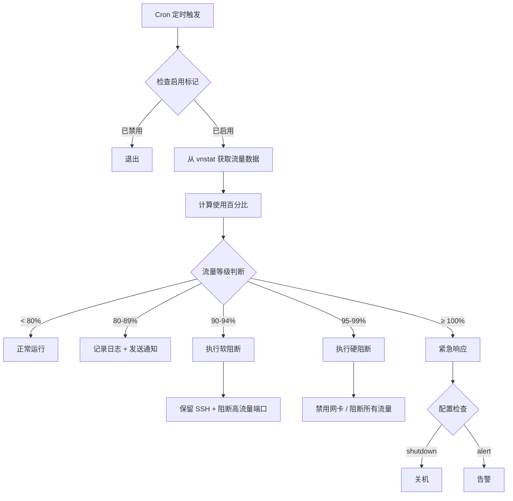

# 超流量保护系统 🛡️

<div align="center">

**Traffic Limit Protection System**

[](https://opensource.org/licenses/MIT)
[](https://www.gnu.org/software/bash/)
[](https://github.com/oyport/traffic-limit-protection)

*一个智能的 Linux 服务器流量监控与保护系统，防止因流量超限导致的高额费用*

[功能特性](#功能特性) • [快速开始](#快速开始) • [使用指南](#使用指南) • [配置说明](#配置说明) • [常见问题](#常见问题)

</div>

---

## 📖 项目简介

超流量保护系统是一个专为 Linux 服务器设计的自动化流量监控与保护解决方案。当服务器流量接近或超过预设阈值时，系统会自动采取分级响应措施，有效防止因流量超限而产生的高额费用。

### 适用场景

- 🌐 **VPS/云服务器** - 防止流量超出套餐限制
- 💰 **按流量计费服务器** - 避免意外流量费用
- 🔒 **高安全要求环境** - DDoS 攻击时自动限流保护
- 🚀 **小型网站/API 服务** - 流量异常时自动降级保护

---

## ✨ 功能特性

### 核心功能

#### 🎯 分级响应机制
```
80% ────> 📊 日志记录 + 通知告警
90% ────> 🔶 软阻断（保留 SSH，阻断高流量端口）
95% ────> 🔴 硬阻断（禁用网卡或阻断所有流量）
100% ───> ⚠️ 可选关机保护
```

#### 🛠️ 灵活的阻断策略

**软阻断模式**（90% 触发）
- ✅ 保留 SSH 等关键端口访问
- ✅ 白名单 IP 地址不受影响
- ❌ 阻断 HTTP/HTTPS 等高流量端口
- 🎯 适合紧急限流但需保持管理访问

**硬阻断模式**（95% 触发）
- 🔒 阻断所有网络流量（仅保留本地回环）
- 📴 可选禁用网卡（需手动重启恢复）
- 🚨 极端保护措施

#### 📊 强大的统计功能

```bash
# 实时流量监控
tx-ctl status           # 当前状态 + 进度条可视化

# 多维度统计分析
tx-ctl stats summary    # 本月/今日流量概览
tx-ctl stats daily      # 每日流量趋势
tx-ctl stats hourly     # 24小时详细统计
tx-ctl stats export     # 导出 CSV 数据
```

#### 🔔 多渠道通知

- 📧 **邮件通知** - 通过 `mail` 命令发送
- 🌐 **Webhook** - 支持自定义 HTTP 回调
- 💬 **集成支持** - Slack、Discord、Telegram（预留）
- 📝 **审计日志** - 所有操作完整记录

#### 🩺 系统健康检查

```bash
tx-ctl doctor
```
自动检测：
- ✓ vnstat 服务状态
- ✓ 防火墙配置正确性
- ✓ Cron 任务配置
- ✓ 网卡状态
- ✓ 磁盘空间
- ✓ 日志文件大小

---

## 🚀 快速开始

### 系统要求

- **操作系统**: Linux (Ubuntu/Debian/CentOS/RHEL/Rocky/AlmaLinux)
- **权限**: Root 或 sudo
- **依赖**: `bash`, `vnstat`, `jq`, `iptables`

### 一键安装

```bash
# 克隆仓库
git clone https://github.com/oyport/traffic-limit-protection.git
cd traffic-limit-protection

# 运行安装脚本
sudo bash install.sh
```

### 安装过程

安装脚本会引导您完成以下步骤：

1. **依赖检查与安装** - 自动安装 vnstat、jq 等必需组件
2. **网卡选择** - 智能识别可用网卡
3. **交互式配置** - 设置流量阈值、响应动作等
4. **自动部署** - 配置定时任务、初始化服务

### 立即启用

```bash
# 启用监控
sudo tx-ctl enable

# 查看状态
sudo tx-ctl status

# 健康检查
sudo tx-ctl doctor
```

---

## 📚 使用指南

### 基础操作

#### 启用/禁用监控

```bash
# 启用监控
sudo tx-ctl enable

# 禁用监控（不会清除防火墙规则）
sudo tx-ctl disable

# 解除所有阻断
sudo tx-ctl unblock
```

#### 查看状态

```bash
# 完整状态报告（包括可视化进度条）
sudo tx-ctl status

# 示例输出：
# ========================================
#   超流量保护系统 - 状态报告
# ========================================
# 
# ● 监控状态: 已启用
# ● 监控网卡: eth0
# ● 流量阈值: 30000 MB
# ● 当前流量: 15420 MB / 30000 MB (51%)
#   [████████████████████░░░░░░░░░░░░░░░░░░░░] 51%
# ● 阻断状态: 正常运行
```

#### 流量统计

```bash
# 综合统计
sudo tx-ctl stats

# 每日流量
sudo tx-ctl stats daily

# 小时统计（最近24小时）
sudo tx-ctl stats hourly

# 详细分析
sudo tx-ctl stats detail

# 导出数据
sudo tx-ctl stats export
```

#### 日志查看

```bash
# 查看最近50行日志
sudo tx-ctl logs

# 查看最近200行
sudo tx-ctl logs 200

# 实时跟踪日志
sudo tail -f /var/log/tx-monitor.log
```

### 高级操作

#### 快速调整阈值

```bash
# 设置阈值为 50GB
sudo tx-ctl set-threshold 50000

# 设置阈值为 100GB
sudo tx-ctl set-threshold 100000
```

#### 测试配置

```bash
# 测试运行（不会执行实际动作）
sudo tx-ctl test

# 强制立即检查
sudo tx-ctl force-check
```

#### 防火墙规则管理

```bash
# 查看当前防火墙规则
sudo tx-ctl rules show

# 清除所有监控相关规则
sudo tx-ctl rules clear
```

#### 编辑配置

```bash
# 使用默认编辑器编辑配置文件
sudo tx-ctl config
```

---

## ⚙️ 配置说明

### 配置文件位置

- **主配置**: `/etc/tx-monitor.conf`
- **示例配置**: `tx-monitor.conf.example`

### 核心配置项

```bash
# 基础配置
INTERFACE="eth0"                 # 监控的网卡
THRESHOLD_MB=30000              # 月流量阈值（MB）
CHECK_INTERVAL=10               # 检查间隔（分钟）

# 响应阈值
WARNING_LEVEL_1=80              # 第一级警告（%）
WARNING_LEVEL_2=90              # 软阻断触发点（%）
WARNING_LEVEL_3=95              # 硬阻断触发点（%）

# 响应动作
ACTION_AT_90="block_ports"      # 90% 时: 软阻断
ACTION_AT_95="disable_interface" # 95% 时: 硬阻断-禁用网卡
ACTION_AT_100="alert"           # 100% 时: 仅告警

# 端口配置
WHITELIST_PORTS="22,443"        # 软阻断时保留的端口
BLOCK_PORTS="80,8080,3000"      # 软阻断时优先阻断的端口
WHITELIST_IPS=""                # 白名单IP地址

# 通知配置
ENABLE_NOTIFICATIONS=true       # 启用通知
NOTIFICATION_EMAIL=""           # 邮件地址
WEBHOOK_URL=""                  # Webhook地址
```

### 动作类型说明

| 配置项 | 可选值 | 说明 |
|--------|--------|------|
| `ACTION_AT_90` | `block_ports` | 阻断非必要端口（软阻断） |
|  | `alert` | 仅发送告警通知 |
| `ACTION_AT_95` | `disable_interface` | 禁用网卡（需手动恢复） |
|  | `block_all` | 阻断所有流量 |
|  | `alert` | 仅发送告警通知 |
| `ACTION_AT_100` | `shutdown` | ⚠️ 立即关机 |
|  | `alert` | 仅发送告警通知 |

### 预设模板

#### 低流量模板（10GB）
```bash
THRESHOLD_MB=10000
WARNING_LEVEL_1=80
WARNING_LEVEL_2=90
WARNING_LEVEL_3=95
```
适用：个人博客、展示站点

#### 均衡模板（50GB）
```bash
THRESHOLD_MB=50000
WARNING_LEVEL_1=80
WARNING_LEVEL_2=90
WARNING_LEVEL_3=95
```
适用：小型网站、API 服务

#### 高流量模板（100GB）
```bash
THRESHOLD_MB=100000
WARNING_LEVEL_1=85
WARNING_LEVEL_2=92
WARNING_LEVEL_3=97
```
适用：业务服务器、视频站点

---

## 🔧 命令参考

### tx-ctl 完整命令列表

```bash
# 监控控制
tx-ctl enable                    # 启用监控
tx-ctl disable                   # 禁用监控
tx-ctl status                    # 查看状态
tx-ctl unblock                   # 解除阻断

# 流量统计
tx-ctl stats [类型]              # 流量统计
  - summary   (默认) 综合统计
  - daily     每日流量
  - monthly   每月流量
  - hourly    小时流量
  - detail    详细分析
  - export    导出CSV

# 日志查看
tx-ctl logs [行数]               # 查看日志（默认50行）

# 测试与检查
tx-ctl test                      # 测试配置
tx-ctl force-check               # 强制检查
tx-ctl doctor                    # 健康检查

# 配置管理
tx-ctl config                    # 编辑配置
tx-ctl set-threshold <MB>        # 快速设置阈值
tx-ctl reset                     # 重置统计数据

# 防火墙规则
tx-ctl rules show                # 显示规则
tx-ctl rules clear               # 清除规则

# 其他
tx-ctl help                      # 帮助信息
tx-ctl version                   # 版本信息
```

---

## 📁 项目结构

```
traffic-limit-protection/
├── tx-monitor.sh              # 核心监控脚本
├── tx-ctl                     # 管理控制工具
├── install.sh                 # 一键安装脚本
├── uninstall.sh               # 卸载脚本
├── test.sh                    # 测试套件
├── tx-monitor.conf.example    # 配置文件示例
├── README.md                  # 项目文档
└── LICENSE                    # MIT 许可证
```

### 系统文件位置

```
/usr/local/bin/
├── tx-monitor.sh              # 监控脚本
└── tx-ctl                     # 控制工具

/etc/
└── tx-monitor.conf            # 配置文件

/var/log/
├── tx-monitor.log             # 运行日志
└── tx-monitor-audit.log       # 审计日志

/run/
├── tx-monitor.enabled         # 启用标记
├── tx-monitor.soft-block      # 软阻断标记
├── tx-monitor.hard-block      # 硬阻断标记
└── tx-monitor.last-action     # 最后动作时间
```

---

## 🔐 安全特性

### 默认安全机制

1. **手动启用** - 安装后默认禁用，需手动启用
2. **重启保护** - 系统重启后自动禁用监控（防止误锁定）
3. **SSH 保护** - 软阻断和硬阻断始终保留 SSH 访问
4. **白名单机制** - 支持 IP 和端口白名单
5. **审计日志** - 完整记录所有操作和配置变更
6. **冷却期** - 防止短时间内重复执行阻断动作

### 恢复方式

#### 远程恢复（SSH 可用）
```bash
# 解除阻断
sudo tx-ctl unblock

# 禁用监控
sudo tx-ctl disable
```

#### 本地恢复（控制台）
```bash
# 清除防火墙规则
sudo iptables -F TX_MONITOR_BLOCK
sudo iptables -X TX_MONITOR_BLOCK
sudo iptables -P OUTPUT ACCEPT

# 启用网卡
sudo ip link set eth0 up

# 删除启用标记
sudo rm -f /run/tx-monitor.enabled
```

---

## 📊 工作原理

### 监控流程



### 防火墙规则结构（软阻断示例）

```bash
# 创建自定义链
iptables -N TX_MONITOR_BLOCK

# 白名单端口（SSH）
iptables -A TX_MONITOR_BLOCK -p tcp --dport 22 -j ACCEPT

# 白名单IP
iptables -A TX_MONITOR_BLOCK -d 1.2.3.4 -j ACCEPT

# 阻断高流量端口
iptables -A TX_MONITOR_BLOCK -p tcp --dport 80 -j DROP
iptables -A TX_MONITOR_BLOCK -p tcp --dport 443 -j DROP

# 默认丢弃
iptables -A TX_MONITOR_BLOCK -j DROP

# 应用到 OUTPUT 链
iptables -I OUTPUT -o eth0 -j TX_MONITOR_BLOCK
```

---

## ❓ 常见问题

### Q: 安装后为什么不会自动开始监控？

**A:** 出于安全考虑，系统安装后默认禁用。需手动运行 `sudo tx-ctl enable` 启用监控。

---

### Q: 系统重启后监控还会运行吗？

**A:** 不会。系统重启后监控自动禁用，需重新启用。这是安全设计，防止配置错误导致服务器无法访问。

---

### Q: 如果被误阻断怎么办？

**A:** 
1. 通过 SSH 连接（软阻断保留 SSH 端口）
2. 运行 `sudo tx-ctl unblock` 解除阻断
3. 如果 SSH 无法连接，需通过控制台访问服务器

---

### Q: vnstat 数据不准确怎么办？

**A:** 
```bash
# 重置 vnstat 统计
sudo tx-ctl reset

# 或手动重置
sudo vnstat -i eth0 --remove
sudo vnstat -i eth0 --add

# 重启 vnstat 服务
sudo systemctl restart vnstat
```

---

### Q: 如何临时提高阈值？

**A:**
```bash
# 快速设置新阈值（单位：MB）
sudo tx-ctl set-threshold 50000

# 或编辑配置文件
sudo tx-ctl config
```

---

### Q: 支持多网卡监控吗？

**A:** 当前版本仅支持单网卡监控。如需监控多网卡，可以：
1. 创建多份配置文件
2. 修改脚本使用不同配置
3. 分别设置 cron 任务

---

### Q: 如何完全卸载？

**A:**
```bash
cd traffic-limit-protection
sudo bash uninstall.sh
```
卸载脚本会：
- 停止监控
- 清除防火墙规则
- 删除 cron 任务
- 删除系统脚本
- 可选保留/删除配置和日志
- 可选卸载依赖包

---

### Q: 流量统计从什么时候开始？

**A:** vnstat 从安装时开始收集数据。如果是新安装的服务器，建议等待几小时让 vnstat 积累数据后再启用监控。

---

## 🛠️ 故障排除

### vnstat 服务未运行

```bash
# 检查服务状态
sudo systemctl status vnstat

# 启动服务
sudo systemctl start vnstat

# 设置开机自启
sudo systemctl enable vnstat
```

### 防火墙规则无法生效

```bash
# 检查 iptables 是否安装
sudo iptables -L

# 查看当前规则
sudo tx-ctl rules show

# 清除并重新应用
sudo tx-ctl unblock
sudo tx-ctl force-check
```

### 无法发送通知

```bash
# 检查 mail 命令（邮件通知）
command -v mail

# 测试 Webhook
curl -X POST "$WEBHOOK_URL" \
  -H "Content-Type: application/json" \
  -d '{"test":"message"}'
```

### 日志文件过大

```bash
# 手动轮转日志
sudo mv /var/log/tx-monitor.log /var/log/tx-monitor.log.old
sudo touch /var/log/tx-monitor.log
```

---

## 🤝 贡献指南

欢迎贡献代码、报告问题或提出建议！

### 报告问题

在 [Issues](https://github.com/oyport/traffic-limit-protection/issues) 页面报告问题时，请包含：

- 操作系统版本
- vnstat 版本 (`vnstat --version`)
- 错误日志 (`sudo tx-ctl logs 100`)
- 配置文件内容（隐藏敏感信息）

### 提交 Pull Request

1. Fork 本仓库
2. 创建特性分支 (`git checkout -b feature/AmazingFeature`)
3. 提交更改 (`git commit -m 'Add some AmazingFeature'`)
4. 推送到分支 (`git push origin feature/AmazingFeature`)
5. 开启 Pull Request

---

## 📋 开发计划

### v1.1.0 计划功能

- [ ] Web 管理界面
- [ ] 流量图表可视化
- [ ] 多网卡同时监控
- [ ] 自定义时间范围统计
- [ ] 自动恢复机制
- [ ] Docker 容器支持
- [ ] IPv6 支持
- [ ] 更多通知渠道（钉钉、企业微信）

---

## 📄 许可证

本项目采用 [MIT License](LICENSE) 开源许可证。

```
MIT License

Copyright (c) 2026 oyport

Permission is hereby granted, free of charge, to any person obtaining a copy
of this software and associated documentation files (the "Software"), to deal
in the Software without restriction...
```

---

## 🙏 致谢

本项目基于以下开源工具：

- [vnstat](https://humdi.net/vnstat/) - 网络流量监控
- [jq](https://stedolan.github.io/jq/) - JSON 处理
- [iptables](https://www.netfilter.org/) - 防火墙管理

---

## 📧 联系方式

- **作者**: oyport
- **项目主页**: [https://github.com/oyport/traffic-limit-protection](https://github.com/oyport/traffic-limit-protection)
- **问题反馈**: [Issues](https://github.com/oyport/traffic-limit-protection/issues)

---

<div align="center">

**如果这个项目对您有帮助，请给一个 ⭐ Star！**

Made with ❤️ by oyport

</div>
